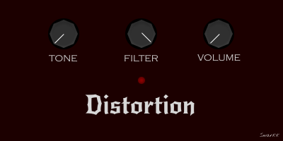

<i>
<s>

  

###

  

###

<h2 align="center">What's up?</h2>

###

<h4 align="center">About Me...</h4>

###

I'm a jack of all trades from Poland  - I'm currently studying programming - Ask me about music and video games - Always working on new cool stuff😎 - I love to combine my personal interests with my work

###

<h2 align="center">TechStack</h2>

###

<h3 align="center">Languages:</h3></s>

###

  
  
  
  
  
  
  
  
  
  
  
  
  

###

<s><h3 align="center">Frameworks:</h3></s>

###

  
  
  
  
  
  
  
  
  

###

<s><h3 align="center">Databases:</h3></s>

###

  
  
  
  
  
  
  
  
  

###

<s><h3 align="center">Graphics:</h3></s>

###

  
  
  
  
  
  
  
  
  

###

<s><h3 align="center">Softwares/IDE's/Tools:</h3></s>

###

  
  
  
  
  
  
  
  
  
  
  
  
  
  
  
  
  
  
  
  
  
  
  
  
  

###

<s><h3 align="center">Everything Else:</h3></s>

###

  
  
  
  
  
  
  

###

<s>
<h4 align="center">And many, many more...</h4>

###

  <h2>🤘</h2>

###

  

###

  

###

  <h2>Thanks for sticking around!</h2>

  

###
<s/>
<i/>